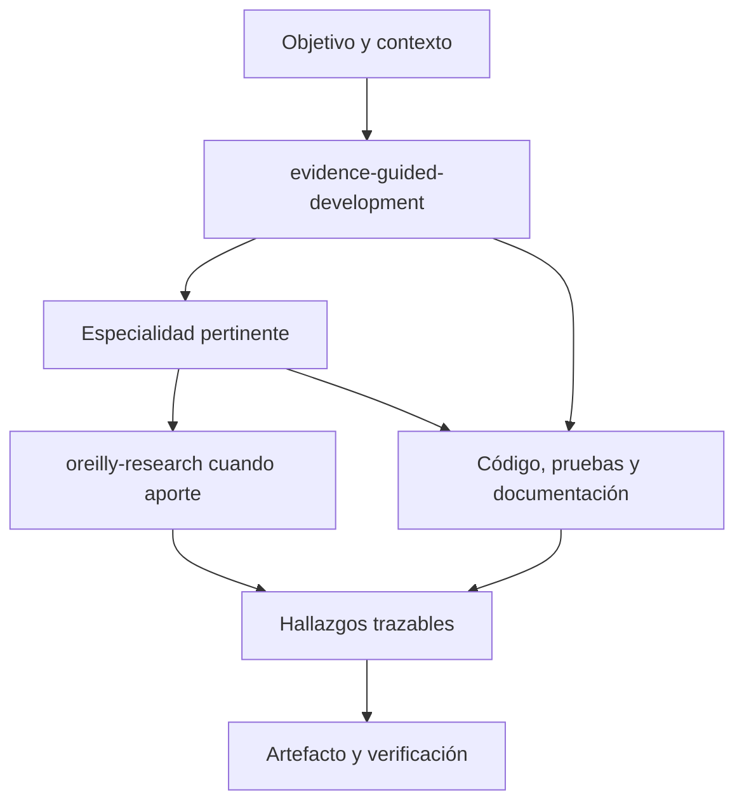

# Investigación aplicada al trabajo de ingeniería

## Flujo

También se puede invocar directamente una especialidad. Las flechas describen un procedimiento, no una API ni una ejecución automática. Un hallazgo leído puede respaldar, contradecir o matizar una afirmación; la aplicación al proyecto se evalúa por separado.

## Catálogo inicial completo

| Skill | Entregable y límite principal |
|---|---|
| evidence-guided-development | Trabajo solicitado hasta su verificación; profundidad proporcional |
| oreilly-research | Evidencia O'Reilly con pasajes y condiciones; no depende de Expert |
| create-decision-brief | Resumen para tomar/comunicar una decisión |
| forecast-project-delivery | Escenarios de entrega; sin probabilidades inventadas |
| assess-team-structure | Responsabilidades y dependencias; sin evaluar personas |
| compare-implementation-approaches | Opciones de implementación y prueba discriminante |
| review-architecture-decision | Revisión de un ADR y sus supuestos |
| review-technical-proposal | Coherencia y omisiones de una propuesta integral |
| evaluate-security-risk | Amenazas, controles y riesgo del alcance concreto |
| plan-service-reliability | Objetivos de confiabilidad y recuperación |
| plan-production-ready-ai | Evaluación, despliegue y operación de IA |
| plan-domain-rampup | Incorporación a dominio/sistema |
| create-learning-plan | Itinerario de aprendizaje y práctica |
| review-code-change | Hallazgos con ubicación y severidad |
| design-data-change | Integridad y transición de datos/contratos |
| analyze-system-performance | Diagnóstico con mediciones comparables |
| investigate-technical-incident | Cronología, hipótesis y causa sustentada |
| design-test-strategy | Pruebas proporcionales a contratos y riesgo |
| technical-requirements-extractor | Requisitos confirmados, inferidos y preguntas |
| repository-issue-generator | Backlog propuesto; publicación requiere alcance autorizado |

## Ejemplo de composición

Petición: añadir idempotencia a una operación sin duplicar efectos.
1. Reutilizar requisitos y contratos del proyecto. Extraer ambigüedades solo si los documentos lo necesitan.
2. Comparar enfoques de implementación si existe una decisión pendiente.
3. Leer evidencia pertinente, reutilizando IDs de hallazgos.
4. EGD implementa el cambio autorizado y ejecuta verificaciones locales.
5. Revisar el diff y documentar el contrato real. No convertir la revisión en permiso para desplegar ni publicar issues.

La cadena se acorta para tareas sencillas. Si faltan O'Reilly o un especialista, trabajar con el contexto y herramientas presentes. Si se pide una fuente concreta y no es accesible, informar ese pendiente.

## Criterios de aceptación

- Cada especialidad funciona directamente y mantiene su artefacto.
- Selección pertinente; sin ciclos ni activación completa por defecto.
- Afirmaciones respaldadas, contradichas y condicionadas quedan separadas.
- Fuentes inaccesibles y Answers solicitado sin acceso se declaran explícitamente.
- EGD completa un cambio local y pruebas sin O'Reilly.
- La instalación evita colisiones silenciosas, conserva una copia anterior y permite inspeccionar lo instalado.
